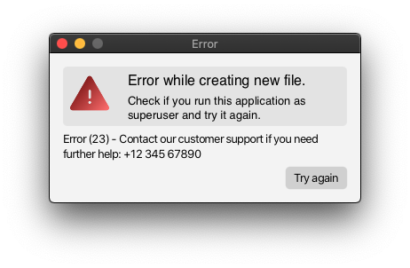
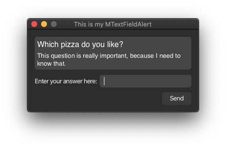
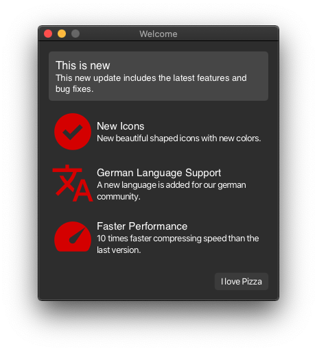

# Modern-Dialog-Windows


> Modern-Dialog-Windows is a JavaFX library with modern-looking alerts. They are a user-friendly alternative to the
> normal JavaFX alerts.

## Looks Awesome. Is Awesome To Use.

**Similar to JavaFX alerts, but with more adaptability.**

You can choose between two styles: rounded and classic and two colour themes: dark and white.
To make the button handling easier, Modern-Dialog-Windows uses normal buttons you
can create with custom text and a custom ActionEvent.

**Based on Stages.**

The idea behind Modern-Dialog-Windows is that you can customize everything you want.
And to do that, every alert can return a Stage with `getStage()`. Example: If you want to change the dimensions
of the Stage, just add `mAlert.getStage().setHeight(200);` to your code.

## Alerts Overview.

| Hierarchy             | Name                   | Version |
|-----------------------|------------------------|---------|
| _1._ **Superclass**   | MDialogWindow          | 1.0.0   |
| _2._ MDialogWindow    | MAlert                 | 1.0.0   |
| _2._ MDialogWindow    | MTextInputAlert        | 1.0.0   |
| _2._ MDialogWindow    | MImageAlert            | 1.0.0   |
| _2._ MDialogWindow    | MWebAlert              | 1.0.0   |
| _2._ MDialogWindow    | MScrollPaneAlert       | 1.0.0   |
| _3._ MScrollPaneAlert | MWelcomeAlert          | 1.0.0   |
| _3._ MScrollPaneAlert | MMultiInformationAlert | 1.0.0   |

## What's New?

**Release 1.1.0 (Same, same but different)**

The new release contains a new alert called `MWebAlert` which can show websites or HTML files in your
alert. This allows you to create log-in alerts or other HTML, CSS and JavaScript alerts.
The backend also changed a lot, however, nothing changes for you, just use this version like any other before.

## Download

Read the [official documentation](https://github.com/GregorGott/Modern-Dialog-Windows/wiki) for more help.

**Download version
1.1.0 (recommended): [Download here](https://github.com/GregorGott/Modern-Dialog-Windows/releases/download/v1.1.0/MDialogWindows-1.1.0.jar)**

**Download version
1.0.0: [Download here](https://github.com/GregorGott/Modern-Dialog-Windows/releases/download/v1.0.0/MDialogWindows-1.0.0.jar)**

## MAlert Sneak Peek.

Let's create a basic MAlert which could be displayed for example when creating a file. For this example a class
with the name, `MyClass` is used to create this alert in the constructor.

```java
public class MyClass {
    public MyClass() {
        MAlert mAlert = new MAlert(MAlert.MAlertType.ERROR, "Error"); // error alert with title
        mAlert.setHeadline("Error while creating a new file."); // set the headliner
        mAlert.setContentText("Check if you run this application as superuser and try it again."); // set the content text (wrap text is enabled)
        mAlert.setInfoText("Error (23) - Contact our customer support if you need further help: +12 345 67890"); // adds some extra information
        mAlert.addButton("Try again", event -> System.out.println("I need HEEELP"), true); // adds a button with a text and an ActionEvent (in this case printing something to the console)
        mAlert.show(); // shows the stage
    }
}
```



## More Screenshots.




## You want to see Modern-Dialog-Windows in Action?

Here are a few projects who are using Modern-Dialog-Windows. Append this list when your project
uses Modern-Dialog-Windows!

Word Guesser uses Modern-Dialog-Windows (Version:
0.1.1): [Word Guesser on GitHub](https://github.com/GregorGott/Word-Guesser)

Math Trainer uses Modern-Dialog-Windows (Version:
0.0.5): [Math Trainer on GitHub](https://github.com/GregorGott/Math-Trainer)
