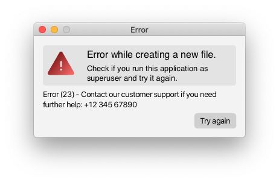

# Modern-Dialog-Windows

> Modern-Dialog-Windows are JavaFX libraries with modern-looking alerts. They are a user-friendly alternative to the
> normal JavaFX alerts.

## Looks Awesome. Is Awesome To Use.

**Similar to JavaFX alerts, but with more adaptability.**

You can choose between
two styles: rounded and classic and two colour themes: dark and white.
To make the button handling easier, Modern-Dialog-Windows uses normal buttons you
can create with custom text and a custom ActionEvent.

## Based on Stages.

The idea behind Modern-Dialog-Windows is that you can customize everything you want.
And to do that, Modern-Dialog-Windows returns a Stage on which you can change everything
(e.g. you can apply your custom stylesheets).

## Alerts overview.

| Name              | Version | Released                      |
|-------------------|---------|-------------------------------|
| MAlert            | 0.1.1   | Yes                           |
| MTextInputAlert   | 0.0.2   | Yes                           |
| MImageAlert       | 0.0.1   | Yes                           |
| MWelcomeAlert     | 0.0.2   | Yes                           |
| MInformationAlert | -       | No (Planned for next release) |

## MAlert Sneak Peek.

Let us create this warning:

Code:

    MAlert mAlert = new MAlert(MAlertType.INFORMATION);
    mAlert.setAlertStyle(MAlert.MAlertStyle.DARK_ROUNDED);
    mAlert.setAlertTitle("I like this.");
    mAlert.setHeadline("A very informative headline.");
    mAlert.setContentText("Looks modern and familiar. And it is very simple to use.");
    mAlert.addButton("My custom button", x -> System.out.println("Hello"), true);
    mAlert.getStage().show();

## More Screenshots.

## You want to see Modern-Dialog-Windows in action?

Word Guesser uses MAlerts (Version: 0.0.2): [GitHub Word Guesser](https://github.com/GregorGott/Word-Guesser)
